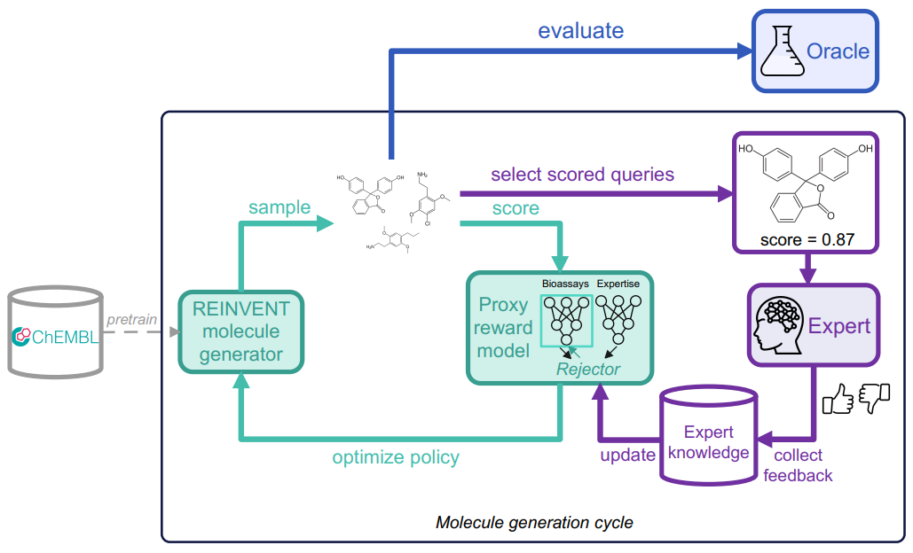

# Leveraging expert feedback to align proxy and ground truth reward models in goal-oriented molecule generation

With the aim of mitigating the reward hacking problem that often occurs in goal-oriented molecule generation with Reinforcement Learning, we propose a novel method for scoring the molecules that relies on experimental data and human knowledge alternatively and where human feedback can be leveraged and used to update the reward model through active learning. Our method consists of two parts:

**1. Before the generation :** we build a proxy reward model that combines knowledge from experimental assays and domain expertise into two separately trained models, equipped with a rejector model that determines to which model should the prediction of the reward score be deferred.

**2. During the generation :** the trained rejector decides to which of the experimental or human model should the scoring of a new molecule be deferred based on their respective confidence in the prediction. Expert binary feedback on the generated molecules is actively queried and used to update the human model and therefore the rejector.

Note: in real-world cases, oracle evaluation is only possible at the end of a generation cycle, for a certain portion of the generated molecules (e.g., top 1000 high-scoring molecules). No ground truth labels from experimental assays will be obtained throughout the generation cycle.

For more details, please check our [AI4D3](https://ai4d3.github.io/) workshop paper right [here](https://ai4d3.github.io/papers/54.pdf) !
____________________________________________________________________________________________________________________________________________________________

# Required dependencies and packages

To run this code, you would need the following:
- `torch==1.7.1`
- `gpflow==2.9.0`
- `tensorflow==2.13.1`
- `rdkit`, `PyTDC`, `pandas`, `numpy`, `scikit-learn`

Also make sure to install REINVENT from the [MAI repository](https://github.com/MolecularAI/Reinvent) and create a separate environment for REINVENT using the provided `reinvent.yml` file.

Note: Currently, REINVENT uses the pip package `reinvent-scoring==0.0.73` which is outdated at the moment. We are working on an updated version of this package which will be made available here soon.

____________________________________________________________________________________________________________________________________________________________

# Contact us!

Thank you for your interest in our method.
Since this is still an ongoing work, we would be happy to receive your feedback and answer your questions at yasmine.nahal@aalto.fi or julien.martinelli@aalto.fi.
 
